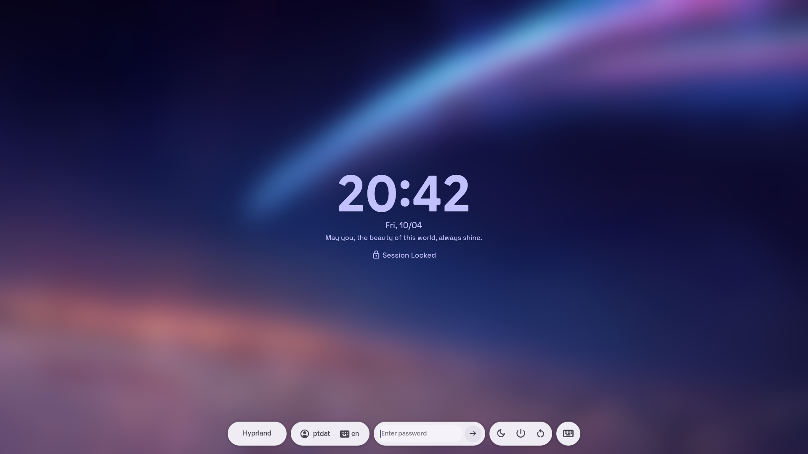
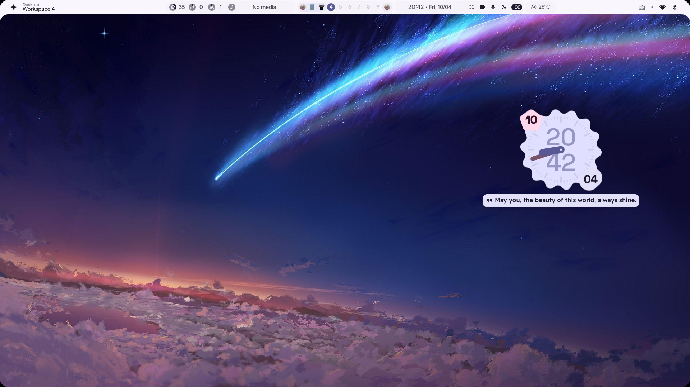
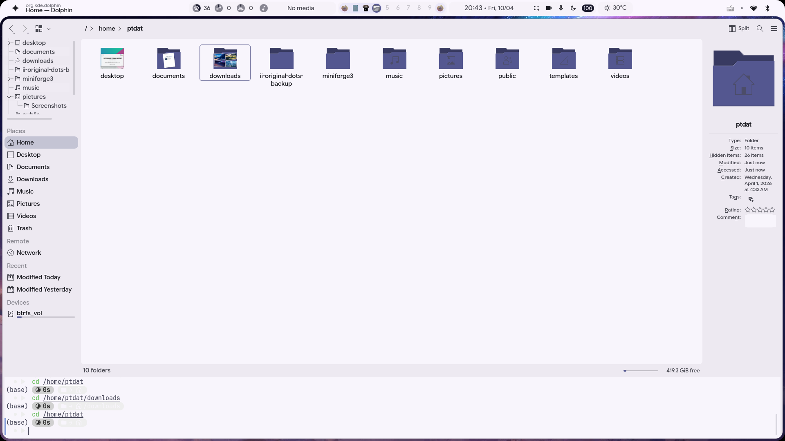
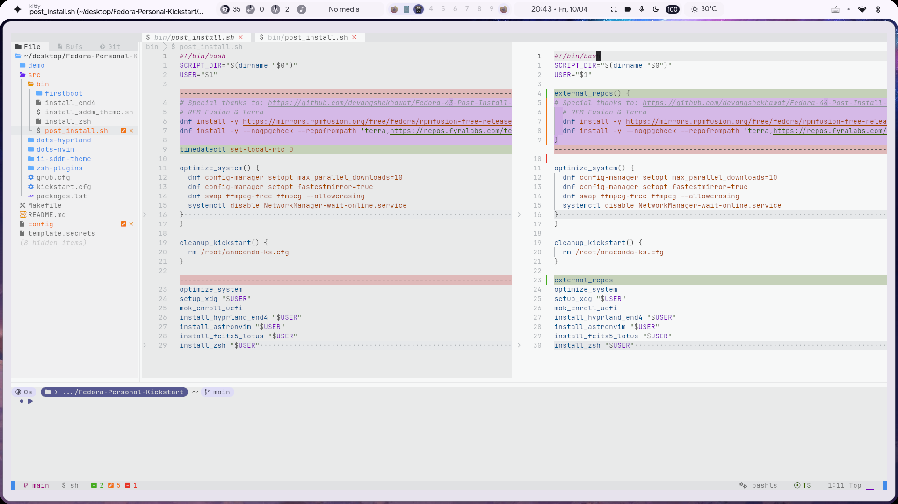

# Fedora Personal ISO

This project provides a streamlined way to create a customized Fedora Everything netinst ISO with automated kickstart configuration, pre-installed packages, and pre-configured dotfiles/scripts.

## Screenshots

<p align="center">
  
  
  
  
</p>

## Notable Features

- **System Optimizations**:
  - DNF parallel downloads (10) and fastest mirror selection.
  - Full FFmpeg support (swapped from `ffmpeg-free`).
  - Disabled `NetworkManager-wait-online.service` for faster boot.
- **Desktop Environment (Hyprland)**:
  - Automated installation of **End-4 dotfiles**.
  - Custom fixes for Swappy, Dolphin, and theme transitions.
  - Pre-configured SDDM with a personalized theme.
- **Development & Shell**:
  - **AstroNvim** pre-configured and ready to use.
  - **Zsh** as the default shell (replacing fish) with Oh My Zsh, Starship, and plugins (autosuggestions, syntax highlighting, vi-mode).
- **Localization & Input**:
  - **Fcitx5-Lotus** integrated for Vietnamese input.
- **Hardware Support**:
  - Automated **MOK enrollment** for Secure Boot compatibility (essential for NVIDIA drivers).
- **User Experience**:
  - Normalized XDG directories (lowercase: `~/downloads`, `~/documents`, etc.).
  - Default application associations (e.g., MPV for video, Firefox for PDF).

## Prerequisites

Ensure you have the following tools installed on your system:

- **ISO Tools**: `libisoburn` (provides `osirrox` and `xorriso`)
- **System Tools**: `rsync`, `curl`, `util-linux` (for `mountpoint`)
- **Virtualization (Optional, for testing)**: `virt-install`, `libvirt`, `qemu-kvm`

## Configuration

Before building the ISO, you need to set up your configuration and secrets.

Create a `.env` file by copying the template:
```bash
cp template.env .env
```
Edit `.env` and provide the following passwords:
- `ROOT_PASSWD`: Root user password.
- `USER_PASSWD`: Personal user password.
- `MOKUTIL_PASSWD`: Password for Secure Boot MOK utility.
- `USER`: The username for the primary account.
- `DISK`: The target disk for installation (e.g., `nvme0n1` or `sda`).

## Building the ISO

To generate the custom ISO, simply run:

```bash
make build
```

This command will:
1. Download the base Fedora Everything ISO (if not already present).
2. Extract the base ISO to the `base-iso/` directory.
3. Prepare the kickstart and GRUB configurations with your specified settings.
4. Copy custom scripts (`src/bin`), dotfiles, and plugins into the ISO image.
5. Create the final ISO at `dist/Fedora-43-Personal-x86_64.iso`.

## Testing the ISO

You can test the generated ISO in a virtual machine using KVM/libvirt:

```bash
make install_os
```
This will:
1. Clean up any existing VM with the same name.
2. Create a new 40GB virtual disk.
3. Launch a VM and boot from your custom ISO.

To manage the test VM:
- **Stop and delete the VM**: `make destroy_vm`
- **Re-launch existing installation**: `make load_os`

## Project Structure

- `src/kickstart.cfg`: The base kickstart configuration template.
- `src/packages.lst`: List of package groups and individual packages to be installed.
- `src/bin/`: Scripts that are copied to the ISO and can be executed post-install.
- `src/dots-hyprland/`: Hyprland dotfiles.
- `src/dots-nvim/`: Neovim configuration.
- `src/zsh-plugins/`: Custom Zsh plugins.

## Troubleshooting

- **Permissions**: Ensure you have the necessary permissions to mount/extract ISOs or run `virt-install`.
- **Base ISO**: If the download fails, you can manually place the `Fedora-Everything-netinst-x86_64-43-1.6.iso` file in the project root.
